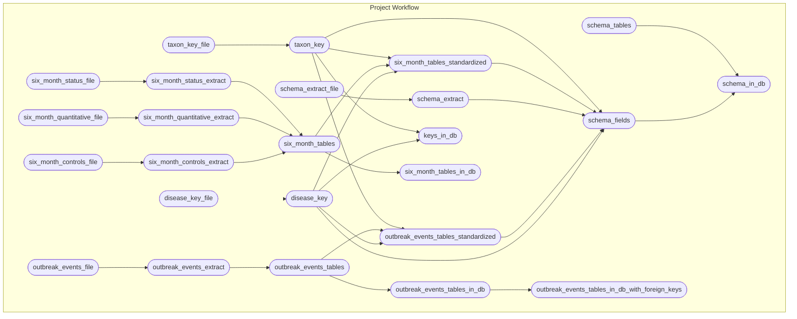

<!-- README.md is generated from README.Rmd. Please edit that file -->

# wahisdb

[-MIT-green.svg)](https://opensource.org/licenses/MIT)
[-CC0_1.0-lightgrey.svg)](http://creativecommons.org/publicdomain/zero/1.0/)

This package accesses and formats veterinary disease data from [OIE
WAHIS](https://wahis.woah.org/#/home). Data is currently static
(outbreaks are from April 2023 and six month reports from August 2023).
In the future, we expect the data to be updated weekly. Publicly
available on DoltHub:
<https://www.dolthub.com/repositories/ecohealthalliance/wahisdb>.

## Database Tables

- **wahis_epi_events** Summarizes high level event data, where each row
  is an independent event, as defined by the reporting country.
  `epi_event_id_unique` is the generated primary key. This table
  included hand-curated disease name standardization and taxonomy.
- **wahis_outbreaks** Detailed location and impact data for outbreak
  subevents (e.g., individual farms within a larger outbreak event).
  `report_outbreak_species_id_unique` is a generated unique primary key.
  This table can be joined with wahis_epi_events by
  `epi_event_id_unique`.
- **wahis_six_month_status** Disease status by 6-month semester.
  `unique_id` is a generated unique primary key.
- \*\*wahis_six_month_controls\*“\*\* Control measures applied by
  disease and taxa by 6-month semester. `unique_id` is a generated
  unique primary key.
- **wahis_six_month_quantitative** Aggregated impact data from outbreak
  events reports AND six monthly reports on 6-month basis.
  `six_month_quantitative_unique_id` is a generated unique primary key.

## Repository Structure and Reproducibility

- `wahisdb/` contains the dolt database. See instructions below.
- `R/` contains functions used in this analysis.
- This project uses the `targets` package to create its analysis
  pipeline. The steps are defined in the `_targets.R` file and the
  workflow can be executed by running `targets::tar_make()`.
- The schematic figure below summarizes the steps. (The figure is
  generated using `mermaid.js` syntax and should display as a graph on
  GitHub.It can also be viewed by pasting the code into
  <https://mermaid.live>.)

## Dolt

- Install and configure the database software, dolt:
  <https://www.dolthub.com/blog/2020-02-03-dolt-and-dolthub-getting-started/>
- Install: sudo curl -L
  <https://github.com/dolthub/dolt/releases/latest/download/install.sh>
  \| sudo bash
- Provide credentials:
  `dolt config --global --add user.email YOU@DOMAIN.COM` and
  `dolt config --global --add user.name "YOUR NAME"` Login: dolt login
- Copy key to <https://www.dolthub.com/settings/credentials>
- Clone the dolt database: dolt clone ecohealthalliance/wahisdb

## renv

- This project uses the [{renv}](https://rstudio.github.io/renv/)
  framework to record R package dependencies and versions. Packages and
  versions used are recorded in `renv.lock` and code used to manage
  dependencies is in `renv/` and other files in the root project
  directory. On starting an R session in the working directory, run
  `renv::restore()` to install R package dependencies.
