<!-- README.md is generated from README.Rmd. Please edit that file -->

# wahisdb

[-MIT-green.svg)](https://opensource.org/licenses/MIT)
[-CC0_1.0-lightgrey.svg)](http://creativecommons.org/publicdomain/zero/1.0/)

This package accesses and formats veterinary disease data from [OIE
WAHIS](https://wahis.woah.org/#/home). Data is updated weekly and is
publicly available on DoltHub:
<https://www.dolthub.com/repositories/ecohealthalliance/wahisdb>.

## Database Tables

- **outbreak_reports_ingest_status_log** List of reports in database.
  `report_info_id` can be appended to
  “<https://wahis.oie.int/pi/getReport/>” to see the report API, and to
  “<https://wahis.oie.int/#/report-info?reportId=>” to see the formatted
  outbreak report.
- **disease_key** lookup for disease name standardization and taxonomy.
  Currently not being used within this workflow.
- **outbreak_reports_diseases_unmatched** disease names that were not
  found in the ANDO disease name lookup.
- **outbreak_reports_events_raw** High-level event information including
  country, disease and disease status. Disease names are standardized to
  the [Animal Disease
  Ontology](http://agroportal.lirmm.fr/ontologies/ANDO%5D) from the
  French National research institute for agriculture, food and the
  environment. Each row is an outbreak report. `report_id` is the unique
  report ID.
- **outbreak_summary** a cleaned-up version of
  outbreak_reports_events_raw.
- **outbreak_reports_details_raw** Detailed location and impact data for
  outbreak events. This table can be joined with
  `outbreak_reports_events` by `report_id`. `outbreak_location_id` is a
  unique ID for each location (e.g, farm or village) within a outbreak.
  The field `id` is the unique combination of the `report_id`,
  `outbreak_location_id`, and `taxa`.
- **outbreak_time_series** a cleaned-up version of
  outbreak_reports_details_raw

## Repository Structure and Reproducibility

- `wahisdb/` contains the dolt database. See instructions below.
- `R/` contains functions used in this analysis.
- This project uses the `targets` package to create its analysis
  pipeline. The steps are defined in the `_targets.R` file and the
  workflow can be executed by running `targets::tar_make()`.
- The schematic figure below summarizes the steps. (The figure is
  generated using `mermaid.js` syntax and should display as a graph on
  GitHub.It can also be viewed by pasting the code into

``` mermaid
graph LR
subgraph Project Workflow
    direction LR
    xee7424e02a59d87c(["wahis_outbreak_reports_new"]):::skipped --> x0124a0ba3158063b(["wahis_outbreak_reports_responses"]):::skipped
    x3fa380dc1bb2ee6e(["disease_key"]):::skipped --> x96e683a1482e53af(["disease_key_in_db"]):::skipped
    xbddb73c04cc744ca(["disease_key_file"]):::skipped --> x3fa380dc1bb2ee6e(["disease_key"]):::skipped
    x5ba3623a087a3fa4(["wahis_outbreak_reports_list"]):::skipped --> xf4db92eee1ce8cbd(["wahis_outbreak_data_raw"]):::skipped
    x4b355d8586962d34(["wahis_outbreak_reports_list_updated"]):::skipped --> xf4db92eee1ce8cbd(["wahis_outbreak_data_raw"]):::skipped
    x0124a0ba3158063b(["wahis_outbreak_reports_responses"]):::skipped --> xf4db92eee1ce8cbd(["wahis_outbreak_data_raw"]):::skipped
    xf3212ca56c0218b5(["wahis_outbreak_data_raw_in_db"]):::built --> x935b960f25c25261(["wahis_outbreak_data"]):::built
    x5ba3623a087a3fa4(["wahis_outbreak_reports_list"]):::skipped --> xee7424e02a59d87c(["wahis_outbreak_reports_new"]):::skipped
    x935b960f25c25261(["wahis_outbreak_data"]):::built --> x2f446dad029b8aba(["wahis_outbreak_data_in_db"]):::built
    xf4db92eee1ce8cbd(["wahis_outbreak_data_raw"]):::skipped --> xf3212ca56c0218b5(["wahis_outbreak_data_raw_in_db"]):::built
    xee7424e02a59d87c(["wahis_outbreak_reports_new"]):::skipped --> x4b355d8586962d34(["wahis_outbreak_reports_list_updated"]):::skipped
    x0124a0ba3158063b(["wahis_outbreak_reports_responses"]):::skipped --> x4b355d8586962d34(["wahis_outbreak_reports_list_updated"]):::skipped
  end
linkStyle 0 stroke-width:0px;
```

  <https://mermaid.live>.)

## Dolt

- Install and configure the database software, dolt:
  <https://www.dolthub.com/blog/2020-02-03-dolt-and-dolthub-getting-started/>
- Install: sudo curl -L
  <https://github.com/dolthub/dolt/releases/latest/download/install.sh>
  \| sudo bash
- Provide credentials: dolt config –global –add user.email
  <YOU@DOMAIN.COM> and dolt config –global –add user.name “YOUR NAME”
  Login: dolt login
- Copy key to <https://www.dolthub.com/settings/credentials>
- Clone the dolt database: dolt clone ecohealthalliance/wahisdb

## renv

- This project uses the [{renv}](https://rstudio.github.io/renv/)
  framework to record R package dependencies and versions. Packages and
  versions used are recorded in `renv.lock` and code used to manage
  dependencies is in `renv/` and other files in the root project
  directory. On starting an R session in the working directory, run
  `renv::restore()` to install R package dependencies.
