<!-- README.md is generated from README.Rmd. Please edit that file -->

# wahisdb

[-MIT-green.svg)](https://opensource.org/licenses/MIT)
[-CC0_1.0-lightgrey.svg)](http://creativecommons.org/publicdomain/zero/1.0/)

This package accesses and formats veterinary disease data from [OIE
WAHIS](https://wahis.woah.org/#/home). Data is updated weekly and is
publicly available on DoltHub:
<https://www.dolthub.com/repositories/ecohealthalliance/wahisdb>.

## Database Tables

- **outbreak_reports_ingest_status_log** List of ingested reports. If
  report ingestion failed, the error will be in the `ingest_error`
  field. `report_info_id` is the unique primary key for this table. It
  represents the base values of the API URL for the report (see the
  `url` field). `dashboard_report_id` is the report ID as it appears in
  the WAHIS dashboard, which does NOT match report_id the tables
  retrieved from the API.
- **outbreak_reports_events_raw** Raw (uncleaned/standardized) data from
  the WAHIS API. Each row is an outbreak report, with high level
  information on the country, disease, and disease status. `report_id`
  is the unique primary key. Note that this is an API-specific report ID
  and does NOT match the report ID shown on the WAHIS dashboard. This
  table can be joined with outbreak_reports_ingest_status_log by
  `report_info_id`.
- **outbreak_reports_details_raw** Raw (uncleaned/standardized) data
  from the WAHIS API. Detailed location and impact data for outbreak
  subevents (e.g., individual farms within a larger outbreak event).
  `unique_id` is a generated unique primary key, consisting of a
  concatenation of report_id, oie_reference (i.e.,
  outbreak_location_id), and species_name (i.e., taxon). This table can
  be joined with outbreak_reports_events_raw by `report_id`
- **outbreak_summary** Summarizes outbreak data by event/thread, with
  cleaned and standardized fields. Each row in an outbreak event.
  `outbreak_thread_id` is the unique primary key, which matches
  `event_id_oie_reference` in outbreak_reports_ingest_status_log.
- **outbreak_time_series** a A cleaned/standardized version of
  outbreak_reports_details_raw. Detailed location and impact data for
  outbreak subevents (e.g., individual farms within a larger outbreak
  event). `unique_id` is a generated unique primary key, consisting of a
  concatenation of report_id, outbreak_location_id, and taxon.
  `unique_id` matches one to one with outbreak_reports_details_raw. This
  table can be joined with outbreak_summary by \`outbreak_thread_id’.
- **disease_key** Hand-curated lookup for disease name standardization
  and taxonomy, used to clean the disease names in outbreak_summary.
  `disease` is the primary key, and can be used to join with outbreak
  summary.
- **scheme_table_info** Description of tables in database (identical to text above).
- **scheme_field_info** Data dictionary for fields in all database.

## Repository Structure and Reproducibility

- `wahisdb/` contains the dolt database. See instructions below.
- `R/` contains functions used in this analysis.
- This project uses the `targets` package to create its analysis
  pipeline. The steps are defined in the `_targets.R` file and the
  workflow can be executed by running `targets::tar_make()`.
- The schematic figure below summarizes the steps. (The figure is
  generated using `mermaid.js` syntax and should display as a graph on
  GitHub.It can also be viewed by pasting the code into

``` mermaid
graph LR
subgraph Project Workflow
    direction LR
    x96e683a1482e53af(["disease_key_in_db"]):::skipped --> x86855963fec06e87(["wahis_data_in_db_with_foreign_keys"]):::built
    xc01c617dffc67677(["wahis_db_check"]):::built --> x86855963fec06e87(["wahis_data_in_db_with_foreign_keys"]):::built
    x2f446dad029b8aba(["wahis_outbreak_data_in_db"]):::built --> x86855963fec06e87(["wahis_data_in_db_with_foreign_keys"]):::built
    xee7424e02a59d87c(["wahis_outbreak_reports_new"]):::skipped --> x0124a0ba3158063b(["wahis_outbreak_reports_responses"]):::skipped
    x3fa380dc1bb2ee6e(["disease_key"]):::skipped --> x96e683a1482e53af(["disease_key_in_db"]):::skipped
    xbddb73c04cc744ca(["disease_key_file"]):::skipped --> x3fa380dc1bb2ee6e(["disease_key"]):::skipped
    x34349c57ef636c8a(["schema_field_info_file"]):::skipped --> x16fa573869d1b28a(["schema_field_info"]):::skipped
    x5ba3623a087a3fa4(["wahis_outbreak_reports_list"]):::skipped --> xf4db92eee1ce8cbd(["wahis_outbreak_data_raw"]):::built
    x4b355d8586962d34(["wahis_outbreak_reports_list_updated"]):::skipped --> xf4db92eee1ce8cbd(["wahis_outbreak_data_raw"]):::built
    x0124a0ba3158063b(["wahis_outbreak_reports_responses"]):::skipped --> xf4db92eee1ce8cbd(["wahis_outbreak_data_raw"]):::built
    x16fa573869d1b28a(["schema_field_info"]):::skipped --> x9c3cd21d02b17883(["schema_in_db"]):::skipped
    xfc1ba76ca5308d8a(["schema_table_info"]):::skipped --> x9c3cd21d02b17883(["schema_in_db"]):::skipped
    x935b960f25c25261(["wahis_outbreak_data"]):::built --> x18f23b0962459876(["wahis_outbreak_data_in_db_rm"]):::queued
    xf3212ca56c0218b5(["wahis_outbreak_data_raw_in_db"]):::built --> x935b960f25c25261(["wahis_outbreak_data"]):::built
    x5ba3623a087a3fa4(["wahis_outbreak_reports_list"]):::skipped --> xee7424e02a59d87c(["wahis_outbreak_reports_new"]):::skipped
    x2cff6713548d5654(["schema_table_info_file"]):::skipped --> xfc1ba76ca5308d8a(["schema_table_info"]):::skipped
    x935b960f25c25261(["wahis_outbreak_data"]):::built --> x2f446dad029b8aba(["wahis_outbreak_data_in_db"]):::built
    x171611bc127fe3a4(["wahis_outbreak_data_primary_keys"]):::skipped --> x2f446dad029b8aba(["wahis_outbreak_data_in_db"]):::built
    x0c4622959901315b(["wahis_outbreak_data_raw_prepped"]):::built --> xf3212ca56c0218b5(["wahis_outbreak_data_raw_in_db"]):::built
    x48332269973d1dbc(["wahis_outbreak_data_raw_primary_keys"]):::skipped --> xf3212ca56c0218b5(["wahis_outbreak_data_raw_in_db"]):::built
    xf4db92eee1ce8cbd(["wahis_outbreak_data_raw"]):::built --> x0c4622959901315b(["wahis_outbreak_data_raw_prepped"]):::built
    xee7424e02a59d87c(["wahis_outbreak_reports_new"]):::skipped --> x4b355d8586962d34(["wahis_outbreak_reports_list_updated"]):::skipped
    x0124a0ba3158063b(["wahis_outbreak_reports_responses"]):::skipped --> x4b355d8586962d34(["wahis_outbreak_reports_list_updated"]):::skipped
  end
linkStyle 0 stroke-width:0px;
```

  <https://mermaid.live>.)

## Dolt

- Install and configure the database software, dolt:
  <https://www.dolthub.com/blog/2020-02-03-dolt-and-dolthub-getting-started/>
- Install: sudo curl -L
  <https://github.com/dolthub/dolt/releases/latest/download/install.sh>
  \| sudo bash
- Provide credentials: dolt config –global –add user.email
  <YOU@DOMAIN.COM> and dolt config –global –add user.name “YOUR NAME”
  Login: dolt login
- Copy key to <https://www.dolthub.com/settings/credentials>
- Clone the dolt database: dolt clone ecohealthalliance/wahisdb

## renv

- This project uses the [{renv}](https://rstudio.github.io/renv/)
  framework to record R package dependencies and versions. Packages and
  versions used are recorded in `renv.lock` and code used to manage
  dependencies is in `renv/` and other files in the root project
  directory. On starting an R session in the working directory, run
  `renv::restore()` to install R package dependencies.
